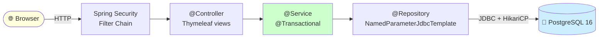

<div align="center">

# 🏦 Banco Digital

Sistema bancário acadêmico full-stack, com autenticação segura, depósitos, saques, transferências, investimentos com juros compostos e extrato.
Construído com **Spring Boot 3 + Thymeleaf + PostgreSQL**, totalmente empacotado em **Docker Compose** — sobe em um comando.

[](https://adoptium.net/)
[](https://spring.io/projects/spring-boot)
[](https://www.postgresql.org/)
[](https://docs.docker.com/compose/)

[](https://maven.apache.org/)
[](https://docs.spring.io/spring-security/)
[](https://www.thymeleaf.org/)
[](https://flywaydb.org/)
[](https://github.com/brettwooldridge/HikariCP)
[](https://junit.org/junit5/)
[](https://www.adminer.org/)

</div>

---

## 📑 Sumário

1. [O que o projeto faz](#-o-que-o-projeto-faz)
2. [Tecnologias](#-tecnologias)
3. [Arquitetura](#-arquitetura)
4. [Quick start](#-quick-start)
5. [Usuários de teste](#-usuários-de-teste)
6. [Estrutura de pastas](#-estrutura-de-pastas)
7. [Testes automatizados](#-testes-automatizados)
8. [Issues resolvidas](#-issues-resolvidas-nesta-entrega)
9. [Próximas entregas](#-próximas-entregas)
10. [Documentação adicional](#-documentação-adicional)

---

## 🎯 O que o projeto faz

O **Banco Digital** simula as operações fundamentais de um banco para fins acadêmicos. Cada usuário cadastrado recebe uma conta única e pode interagir com ela através de uma interface web.

### Fluxos disponíveis

| Fluxo | Descrição | Endpoint |
|---|---|---|
| 🔐 **Cadastro** | Cria um novo usuário + conta zerada (atomicamente). Senha armazenada como hash BCrypt. | `GET / POST /signup` |
| 🔑 **Login** | Autenticação via form (Spring Security + CSRF + session fixation protection). | `GET / POST /login` |
| 🏠 **Painel** | Página inicial com atalhos para todos os serviços. | `GET /dashboard` |
| 💰 **Saldo** | Consulta o saldo atual da conta. | `GET /balance` |
| ⬇ **Depósito** | Credita um valor na conta (registra uma transação). | `GET / POST /deposit` |
| ⬆ **Saque** | Debita um valor (limite diário de R$ 10.000 por operação). | `GET / POST /withdraw` |
| ↔ **Transferência** | Movimenta saldo para outra conta pelo número (`C00001`, ...). Atômica com row-level locking. | `GET / POST /transfer` |
| 📈 **Investimento** | Aplica/Resgata valores num investimento de **1 % de juros compostos por minuto** (lazy update). | `GET / POST /investment` |
| 📜 **Extrato** | Lista todas as transações da conta com cor por tipo e formatação BR. | `GET /statement` |
| 🚪 **Logout** | Encerra a sessão. | `POST /logout` |

### Regras de negócio embutidas

- 💵 Todos os valores monetários usam `BigDecimal` com `scale 2 HALF_UP` (sem erros de ponto flutuante).
- 🔒 Senhas hash BCrypt (strength 10).
- 🛡️ CSRF token automático em todos os forms (Spring Security).
- 🧾 Transações JDBC com `SELECT ... FOR UPDATE` para serializar acesso concorrente.
- 🆔 Números de conta gerados via `SEQUENCE` do Postgres (`C00001`, `C00002`, ... sem colisão).
- 🚫 Validações centralizadas em `com.bancodigital.shared.Messages` — mesma string em validação e UI.

---

## 🛠 Tecnologias

### Linguagem & Build

| Tecnologia | Versão | Propósito |
|---|---|---|
|  Java | **17 LTS** | Linguagem principal — records, sealed types, switch expressions |
|  Maven | **3.9+** | Build, dependency management, plugin lifecycle |

### Backend

| Tecnologia | Versão | Propósito |
|---|---|---|
|  Spring Boot | **3.3.4** | Framework principal (auto-configuration, embedded Tomcat) |
|  Spring Security | **6.x** | Form login, BCrypt, CSRF, sessões |
|  Tomcat (embedded) | **10.1** | Servlet container — empacotado no JAR |
|  Spring JDBC | 3.3.x | `NamedParameterJdbcTemplate` para SQL controlado |
|  HikariCP | embutido | Pool de conexões (default do starter) |
|  Bean Validation | 3.3.x | Anotações para inputs HTTP |
|  Actuator | 3.3.x | `/actuator/health` para healthcheck |

### Persistência

| Tecnologia | Versão | Propósito |
|---|---|---|
|  PostgreSQL | **16-alpine** | Banco relacional |
|  Flyway | **10.x** | Migrations versionadas (`V1__`, `V2__`) aplicadas no boot |

### View

| Tecnologia | Versão | Propósito |
|---|---|---|
|  Thymeleaf | **3.x** | Template engine server-side (escape automático contra XSS) |
| Thymeleaf Spring Security | 6.x | Diretivas `sec:authorize` em templates |
| CSS3 puro | — | Estilização sem framework externo |

### Testes

| Tecnologia | Versão | Propósito |
|---|---|---|
|  JUnit | **5.10** | Framework de testes (Mockito removido por restrição acadêmica) |
| Spring Security Test | 6.x | Apoio a testes (futuro: testes Web com `@WithMockUser`) |

### Infra & DevOps

| Tecnologia | Versão | Propósito |
|---|---|---|
|  Docker | 20+ | Containerização |
|  Docker Compose | v2 | Orquestração local (app + db + admin UI) |
|  Adminer | latest | UI web para inspecionar o Postgres (porta 8081) |
|  Eclipse Temurin | 17-jre | Runtime no container (multi-arch: arm64 + amd64) |

---

## 🏗 Arquitetura



| Camada | Responsabilidade | Anotações Spring |
|---|---|---|
| **Controller** | HTTP (request → view), redirects, flash messages | `@Controller`, `@GetMapping`, `@PostMapping` |
| **Service** | Regra de negócio, validação, transações atômicas | `@Service`, `@Transactional` |
| **Repository** | SQL via `JdbcTemplate`, `RowMapper` | `@Repository`, interface + impl JDBC |

Detalhes em [docs/ARCHITECTURE.md](docs/ARCHITECTURE.md).

---

## 🚀 Quick start

> Você só precisa de **Docker** instalado. Não precisa de Java, Maven nem Postgres no seu sistema — tudo roda em containers.

```bash
git clone <url-do-repo>
cd trabalho-qualidade-e-teste-ffc-grupo-de-guerreiros
docker compose up -d --build
```

Espera ~3-5 min na primeira vez (download de imagens + build). Depois, acesse:

| Serviço | URL |
|---|---|
| 🏦 **Aplicação** | <http://localhost:8080> — login `joao@email.com` / `senha123` |
| 🗄 **Adminer** (UI do banco) | <http://localhost:8081> — server: `postgres`, base/user/pass: `bancodigital` |

➡️ **Guia completo de setup** (como instalar Docker em macOS/Linux/Windows, comandos úteis, troubleshooting): **[docs/SETUP.md](docs/SETUP.md)**

---

## 👥 Usuários de teste

Os seeds (em `V2__seed_data.sql`) criam 5 usuários, **todos com a senha `senha123`** (já hashed com BCrypt no banco):

| E-mail | Conta | Saldo inicial | Histórico |
|---|---|---|---|
| `joao@email.com` | `C00001` | R$ 1.500,00 | 1 depósito + 1 saque + 1 transferência recebida |
| `maria@email.com` | `C00002` | R$ 9.999,99 | 1 depósito + investimento ativo de R$ 500 |
| `pedro@email.com` | `C00003` | R$ 0,00 | conta nova, sem histórico — útil para testar saldo insuficiente |
| `ana@email.com` | `C00004` | R$ 25.000,00 | depósito + saque + 2 transferências enviadas + investimento de R$ 1.500 |
| `carlos@email.com` | `C00005` | R$ 100,00 | depósito + transferência recebida |

> 💡 **Resetar tudo aos seeds**: `docker compose down -v && docker compose up -d` (apaga o volume `pgdata`, Flyway re-aplica V1 + V2 do zero).

---

## 📂 Estrutura de pastas

```
.
├── docker-compose.yml              # 3 serviços: postgres + app + adminer
├── Dockerfile                      # multi-stage: maven build → temurin jre
├── .env.example                    # template de variáveis (POSTGRES_*)
├── .editorconfig                   # consistência de indentação entre IDEs
├── pom.xml                         # Spring Boot 3.3.4 + Java 17
│
├── src/
│   ├── main/
│   │   ├── java/com/bancodigital/
│   │   │   ├── BancodigitalApplication.java
│   │   │   ├── config/             # SecurityConfig, AppConfig, HomeController
│   │   │   ├── shared/             # Messages, Money, DomainException, GlobalExceptionHandler
│   │   │   ├── auth/               # User, UserRepository (interface + Jdbc), CustomUserDetailsService, CurrentUser
│   │   │   ├── signup/             # SignupForm, SignupService, SignupController
│   │   │   ├── account/            # Account, AccountRepository, AccountService + 4 controllers
│   │   │   ├── transaction/        # TransactionType, Transaction, TransactionRepository, StatementLine, StatementController
│   │   │   └── investment/         # Investment, InvestmentRepository, InvestmentService, InvestmentController
│   │   └── resources/
│   │       ├── application.yml             # configs default (datasource via env vars)
│   │       ├── application-docker.yml      # overrides quando SPRING_PROFILES_ACTIVE=docker
│   │       ├── db/migration/
│   │       │   ├── V1__init_schema.sql     # tabelas, índices, sequences, constraints
│   │       │   └── V2__seed_data.sql       # 5 usuários, 5 contas, 10 transações
│   │       ├── static/css/style.css        # estilos compartilhados
│   │       └── templates/                  # 10 templates Thymeleaf
│   │           ├── fragments/layout.html   # topbar + alertas (reuso)
│   │           ├── login.html, signup.html, dashboard.html
│   │           ├── balance.html, withdraw.html, deposit.html
│   │           ├── transfer.html, statement.html
│   │           └── investment.html
│   └── test/java/com/bancodigital/         # 89 testes unitários puros JUnit 5
│
└── docs/
    └── ARCHITECTURE.md             # diagrama + decisões de design
```

---

## 🧪 Testes automatizados

```bash
mvn test                            # roda dentro do container Maven (não precisa Java local)
# ou, dentro do container app:
docker compose exec app sh -c "echo 'use mvn no host ou containerize'"
```

> Para rodar `mvn` no host, instale o JDK 17+ (`brew install openjdk@21` no Mac, ou `apt install openjdk-17-jdk` no Ubuntu) e o Maven (`brew install maven` / `apt install maven`).

### Cobertura atual: **89 testes unitários puros**, todos JUnit 5 sem dependências externas

| Suite | Testes | Componente coberto |
|---|---|---|
| `MoneyTest` | 16 | helpers de `BigDecimal` (parse, normalize, isPositive, format) |
| `TransactionTypeTest` | 9 | enum + `fromDbValue` |
| `StatementLineTest` | 15 | factory `de()`, `colorFor`, `descriptionFor` |
| `SignupServiceTest` | 12 | `validateSignup` (regex e-mail, length de senha, edge cases) |
| `AccountServiceTest` | 23 | `validateWithdraw` / `validateDeposit` / `validateTransfer` |
| `InvestmentServiceTest` | 14 | `calculateInterest` (juros compostos), `validateOperation` |

> Testes que exigem isolamento de dependências via mocks/fakes e testes de integração com Postgres real ficam para a **próxima entrega**.

---

## ✅ Issues resolvidas nesta entrega

Esta PR fecha as seguintes issues do GitHub:

| # | Título | Onde foi resolvido |
|---|---|---|
| **#4** | Migrar Derby → PostgreSQL com Docker Compose | [`docker-compose.yml`](docker-compose.yml), [`V1__init_schema.sql`](src/main/resources/db/migration/V1__init_schema.sql), [`application.yml`](src/main/resources/application.yml) |
| **#12** | Senha em texto plano no banco | `BCryptPasswordEncoder` em `SecurityConfig`, hashes no seed |
| **#13** | Cadastro pode deixar usuário órfão sem conta | [`SignupService.register()`](src/main/java/com/bancodigital/signup/SignupService.java) com `@Transactional` + FK `user_id NOT NULL` |
| **#14** | Cadastro pode gerar números de conta duplicados | `UNIQUE(number)` + `CREATE SEQUENCE account_number_seq` (sem `Math.random`) |
| **#15** | `lazyUpdate` de investimento pode duplicar em concorrência | `UNIQUE(user_id)` em `investments` + `INSERT ... ON CONFLICT DO NOTHING` no `ensureExists` |
| **#16** | Mensagem 'valor inválido' inconsistente | [`Messages.java`](src/main/java/com/bancodigital/shared/Messages.java) centraliza todas as strings |

---

## 🚧 Próximas entregas

Ficam para a **Entrega 2**:

- 🧪 Aumentar cobertura unitária isolando dependências (com **mocks/fakes**).
- 🧫 Testes de integração com **Testcontainers + PostgreSQL real** (Parte B das issues #6, #7, #8, #9, #10).
- 🔄 Pipeline CI/CD via GitHub Actions.

---

## 📚 Documentação adicional

- 🚀 [**docs/SETUP.md**](docs/SETUP.md) — guia completo: como instalar Docker (macOS/Linux/Windows), comandos úteis, troubleshooting.
- 🏗 [**docs/ARCHITECTURE.md**](docs/ARCHITECTURE.md) — diagramas, decisões de design, mapeamento de camadas.

---

<div align="center">
<sub>Trabalho acadêmico de Qualidade e Teste de Software · Grupo de Guerreiros 🛡</sub>
</div>
