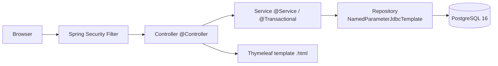

# Arquitetura

A aplicação é um Spring Boot 3 (Java 17) que serve páginas Thymeleaf, persistindo em PostgreSQL via JDBC Template + HikariCP. Spring Security cuida da autenticação form-based com BCrypt e CSRF. Flyway versiona o schema do banco.

## Fluxo de requisição



## Camadas

| Camada     | Responsabilidade                                                   | Anotações                       |
|------------|--------------------------------------------------------------------|--------------------------------|
| Controller | HTTP (request/response, redirect, flash attributes). Sem regra.    | `@Controller`, `@GetMapping`   |
| Service    | Regra de negócio. Transações. Validação. Mensagens (`Messages`).   | `@Service`, `@Transactional`   |
| Repository | SQL via `NamedParameterJdbcTemplate`. `RowMapper` privado.         | `@Repository`                  |

## Pacotes

```
com.bancodigital
├── BancodigitalApplication
├── config
│   ├── SecurityConfig          # SecurityFilterChain + BCryptPasswordEncoder
│   ├── AppConfig               # Clock bean
│   └── HomeController          # GET / → redirect /dashboard
├── shared
│   ├── Messages                # constantes de erro e sucesso (fim do drift da #16)
│   ├── money/Money             # BigDecimal helpers (parse, scale 2 HALF_UP, format BRL)
│   └── exception
│       ├── DomainException
│       └── GlobalExceptionHandler   # @ControllerAdvice
├── auth
│   ├── User                    # record
│   ├── UserRepository          # interface
│   ├── JdbcUserRepository      # impl JDBC
│   ├── CustomUserDetailsService  # ponte para Spring Security
│   ├── CurrentUser              # resolve o User a partir do principal logado
│   ├── LoginController
│   └── DashboardController
├── signup
│   ├── SignupForm
│   ├── SignupService           # @Transactional user + account
│   └── SignupController
├── account
│   ├── Account                 # record
│   ├── AccountRepository       # findByIdForUpdate (row-level lock), debit, credit
│   ├── AccountService          # withdraw, deposit, transfer (@Transactional)
│   ├── BalanceController
│   ├── WithdrawController
│   ├── DepositController
│   └── TransferController
├── transaction
│   ├── Transaction             # record
│   ├── TransactionType         # enum
│   ├── TransactionRepository
│   ├── StatementLine           # DTO de view + formatadores
│   └── StatementController
└── investment
    ├── Investment              # record
    ├── InvestmentRepository    # ensureExists (UPSERT) + update
    ├── InvestmentService       # juros compostos, invest, withdraw (@Transactional)
    └── InvestmentController
```

## Schema de banco

`src/main/resources/db/migration/V1__init_schema.sql`:

```
users        (id, name, email UNIQUE, password_hash, created_at)
accounts     (id, number UNIQUE, balance CHECK >= 0, user_id UNIQUE → users)
                ↑ sequence account_number_seq gera C00001..
transactions (id, source_account? → accounts, destination_account? → accounts, type, amount CHECK > 0, date)
investments  (id, user_id UNIQUE → users, amount CHECK >= 0, last_update)
```

`V2__seed_data.sql` insere 5 usuários (`senha123`) com saldos variados e ~10 transações de exemplo.

## Decisões de design e segurança

- **Senhas**: BCrypt strength 10 via `org.springframework.security.crypto.bcrypt.BCryptPasswordEncoder`.
- **CSRF**: ativo por padrão (Spring Security). Forms Thymeleaf incluem o token via `th:action`.
- **Transações**: `@Transactional` em todos os Services. `findByIdForUpdate` para serializar acesso por conta.
- **Concorrência no Investimento**: `ON CONFLICT (user_id) DO NOTHING` no `ensureExists`, garantindo idempotência mesmo com duas requests simultâneas (fecha issue #15).
- **Geração de número de conta**: sequence `account_number_seq` + `UNIQUE (number)` (fecha issue #14; não há mais `Math.random`).
- **Atomicidade do cadastro**: `SignupService.register` é `@Transactional` — `INSERT users` e `INSERT accounts` ou ambos succedem, ou nenhum (fecha issue #13).
- **Mensagens**: `com.bancodigital.shared.Messages` mantém uma única string por erro/sucesso (fecha issue #16). Constantes em inglês, valores user-facing em PT-BR.
- **Valores monetários**: sempre `BigDecimal` com scale 2, `HALF_UP`.

## Pool de conexões

HikariCP (default do `spring-boot-starter-jdbc`). Configurado em `application.yml`:

```
spring.datasource.hikari.maximum-pool-size: 10
spring.datasource.hikari.minimum-idle: 2
```

## Empacotamento e deploy

- `Dockerfile` multi-stage (Maven 3.9 + Temurin 17 → Temurin 17 JRE Alpine).
- `docker-compose.yml`: `postgres:16-alpine` + app + `adminer:latest`.
- Healthchecks: `pg_isready` no Postgres, `actuator/health` no app, `depends_on: condition: service_healthy`.
- Variáveis de ambiente injetadas via `.env` (template em `.env.example`).
