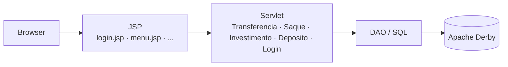

# Arquitetura

Visão geral da arquitetura do sistema bancário acadêmico. A aplicação segue o modelo clássico Servlet + JSP do Jakarta EE: o navegador renderiza páginas JSP, que enviam requisições para Servlets responsáveis por orquestrar a lógica de negócio e o acesso ao banco de dados Apache Derby via JDBC.

## Fluxo de requisição

## Domínios

| Domínio       | Servlet        | Camada de serviço/DAO       |
|---------------|----------------|-----------------------------|
| Transferência | Transferencia  | Acesso JDBC direto ao Derby |
| Saque         | Saque          | Acesso JDBC direto ao Derby |
| Investimento  | Investimento   | Acesso JDBC direto ao Derby |
| Depósito      | Deposito       | Acesso JDBC direto ao Derby |
| Login         | Login          | LoginService + UsuarioDAO   |

## Camada de dados

O acesso ao Apache Derby é feito diretamente via `DriverManager`, sem pool de conexões nem framework ORM. As credenciais (URL JDBC, usuário e senha) ficam em `src/main/resources/db.properties` e são carregadas em tempo de execução por `DatabaseConfig`, que centraliza a leitura do arquivo e a abertura de conexões para os servlets.
