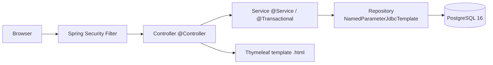

# Arquitetura

A aplicação é um Spring Boot 3 (Java 17) que serve páginas Thymeleaf, persistindo em PostgreSQL via JDBC Template + HikariCP. Spring Security cuida da autenticação form-based com BCrypt e CSRF. Flyway versiona o schema do banco.

## Fluxo de requisição



## Camadas

| Camada     | Responsabilidade                                                   | Anotações                       |
|------------|--------------------------------------------------------------------|--------------------------------|
| Controller | HTTP (request/response, redirect, flash attributes). Sem regra.    | `@Controller`, `@GetMapping`   |
| Service    | Regra de negócio. Transações. Validação. Mensagens.                | `@Service`, `@Transactional`   |
| Repository | SQL via `NamedParameterJdbcTemplate`. `RowMapper` privado.         | `@Repository`                  |

## Pacotes

```
com.bancodigital
├── BancodigitalApplication
├── config
│   ├── SecurityConfig          # SecurityFilterChain + BCryptPasswordEncoder
│   ├── AppConfig               # Clock bean
│   └── HomeController          # GET / → redirect /painel
├── shared
│   ├── Mensagens               # constantes de erro e sucesso (fim do drift da #16)
│   ├── money/Money             # BigDecimal helpers (parse, scale 2 HALF_UP, format BRL)
│   └── exception
│       ├── DomainException
│       └── GlobalExceptionHandler   # @ControllerAdvice
├── login
│   ├── Usuario                 # record
│   ├── UsuarioRepository       # interface
│   ├── JdbcUsuarioRepository   # impl JDBC
│   ├── CustomUserDetailsService  # ponte para Spring Security
│   ├── UsuarioAtual             # resolve o Usuario do principal logado
│   ├── LoginController
│   └── PainelController
├── cadastro
│   ├── CadastroForm
│   ├── CadastroService          # @Transactional usuario + conta
│   └── CadastroController
├── conta
│   ├── Conta                   # record
│   ├── ContaRepository         # findByIdForUpdate (row-level lock), debitar, creditar
│   ├── ContaService            # saque, depósito, transferência (@Transactional)
│   ├── SaldoController
│   ├── SaqueController
│   ├── DepositoController
│   └── TransferenciaController
├── transacao
│   ├── Transacao               # record
│   ├── TipoTransacao           # enum
│   ├── TransacaoRepository
│   ├── ExtratoLinha            # DTO de view + formatadores
│   └── ExtratoController
└── investimento
    ├── Investimento            # record
    ├── InvestimentoRepository  # ensureExists (UPSERT) + atualizar
    ├── InvestimentoService     # juros compostos, investir, retirar (@Transactional)
    └── InvestimentoController
```

## Schema de banco

`src/main/resources/db/migration/V1__init_schema.sql`:

```
usuario  (id, nome, email UNIQUE, senha_hash, criado_em)
conta    (id, numero UNIQUE, saldo CHECK >= 0, usuario_id UNIQUE → usuario)
                ↑ sequence conta_numero_seq gera C00001..
transacao (id, conta_origem? → conta, conta_destino? → conta, tipo, valor CHECK > 0, data)
investimento (id, usuario_id UNIQUE → usuario, valor CHECK >= 0, ultima_att)
```

`V2__seed_data.sql` insere 5 usuários (`senha123`) com saldos variados e ~10 transações de exemplo.

## Decisões de design e segurança

- **Senhas**: BCrypt strength 10 via `org.springframework.security.crypto.bcrypt.BCryptPasswordEncoder`.
- **CSRF**: ativo por padrão (Spring Security). Forms Thymeleaf incluem o token via `th:action`.
- **Transações**: `@Transactional` em todos os Services. `findByIdForUpdate` para serializar acesso por conta.
- **Concorrência no Investimento**: `ON CONFLICT (usuario_id) DO NOTHING` no `ensureExists`, garantindo idempotência mesmo com duas requests simultâneas (fecha issue #15).
- **Geração de número de conta**: sequence `conta_numero_seq` + `UNIQUE (numero)` (fecha issue #14; não há mais `Math.random`).
- **Atomicidade do cadastro**: `CadastroService.cadastrar` é `@Transactional` — `INSERT usuario` e `INSERT conta` ou ambos succedem, ou nenhum (fecha issue #13).
- **Mensagens**: `com.bancodigital.shared.Mensagens` mantém uma única string por erro/sucesso (fecha issue #16).
- **Valores monetários**: sempre `BigDecimal` com scale 2, `HALF_UP`.

## Pool de conexões

HikariCP (default do `spring-boot-starter-jdbc`). Configurado em `application.yml`:

```
spring.datasource.hikari.maximum-pool-size: 10
spring.datasource.hikari.minimum-idle: 2
```

## Empacotamento e deploy

- `Dockerfile` multi-stage (Maven 3.9 + Temurin 17 → Temurin 17 JRE Alpine).
- `docker-compose.yml`: `postgres:16-alpine` + app + `adminer:latest`.
- Healthchecks: `pg_isready` no Postgres, `actuator/health` no app, `depends_on: condition: service_healthy`.
- Variáveis de ambiente injetadas via `.env` (template em `.env.example`).
